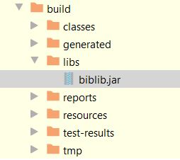

# Лабораторная работа №4. RecyclerView.

## Цели
1. Ознакомиться с принципами работы adapter-based views.
1. Получить практические навки разработки адаптеров для view

## Задачи

В моём распоряжении имеется [библиотека](biblib), предоставляющая программный доступ к записям в формате [bibtex](http://www.bibtex.org). Библиотека имеет 2 режима работы: normal и strict. В strict mode работает искусственное ограничение: в памяти нельзя хранить более `name.ank.lab4.BibConfig#maxValid=20` записей одновременно. При извлечении `maxValid+1`й записи 1я извелеченная запись становится невалидной (при доступе к полям кидаются исключения). Это ограничение позволит быстрее выявлять ошибки при работе с `RecyclerView` и адаптерами.

### Задача 1. Знакомство с библиотекой (unit test)
Необходимо ознакомиться со strict mode библиотеки, проиллюстрировав его работу unit-тестом.

В рамках данного задания был протестирован режим strict mode.

Тест strictModeThrowsException:

    public void strictModeThrowsException() throws IOException {
        BibDatabase database = openDatabase("/mixed.bib");
        BibConfig cfg = database.getCfg();
        cfg.strict = true;
        BibEntry first = database.getEntry(0);
        
        for (int i = 0; i < cfg.maxValid; i++) {
          database.getEntry(0);
          try {
            Assert.assertNotNull("Should not throw any exception @" + i, first.getType());
          } catch (IllegalStateException exp) {
            System.out.println("Throw IllegalStateException with message: " + exp.getMessage());
          }
        }
      }
      
В данном тесте создаём объект базы данных, флаг strict установливаем в true, в first кладём перую запись. В цикле ещё 20 раз обращемся к нулевой записи, следовательно, превышаем лимит. Когда попробуем обратиться к типу first, то получим исключение, так как первая извлечённая запись стала невалидна. 

Тест shuffleFlag:

    public void shuffleFlag() throws IOException {
        BibConfig cfg = new BibConfig();
        cfg.shuffle = false;
        boolean check = false;
        BibDatabase notMixed;
        BibDatabase mixed;

        for (int i = 0; i < 15; i++) {
          try (InputStreamReader reader = new InputStreamReader(getClass().getResourceAsStream("/mixed.bib"))) {
            notMixed = new BibDatabase(reader, cfg);
            mixed = openDatabase("/mixed.bib");
            //System.out.println(notMixed.getEntry(0).getField(Keys.AUTHOR));
            //System.out.println(mixed.getEntry(0).getField(Keys.AUTHOR));
            if (!mixed.getEntry(0).getField(Keys.AUTHOR)
                    .equals(notMixed.getEntry(0).getField(Keys.AUTHOR))) {
              check = true;
            }
          } catch (IOException exp) {
            System.out.println("Throw IOException with message: " + exp.getMessage());
          }
        }
        assertTrue(check);
      }
      
Создадим две базы данных mixed и notMixed. Так как по умолчанию флаг shuffle всегда установлен в true, то для сравнения создадим отдельный объект конфугурации и установим значение shuffle в false. В цикле 15 раз происходит создание перемешанной базы. В процессе попытаемся поймать ситуацию, когда поле автора для первой записи у двух баз - различно. При наличии хотя бы одного совпадаения ставим check в true. Так как записей с различными авторами в файле mixed.bib довольно много, то проверка проходит без каких-либо проблем. 

Также был создан jar файл:

### Задача 2. Знакомство с RecyclerView.
Написать Android приложение, которое выводит все записи из bibtex файла на экран, используя предложенную библиотеку и `RecyclerView`. Будет решаться задача обычной сложности - однородный список

Листинг MainActivity:

    class MainActivity : AppCompatActivity() {
        override fun onCreate(savedInstanceState: Bundle?) {
            super.onCreate(savedInstanceState)

            val manager = LinearLayoutManager(this);
            val binding = ActivityMainBinding.inflate(layoutInflater)
            binding.recyclerView.apply {
                addItemDecoration(DividerItemDecoration(context, manager.orientation))
                layoutManager = manager
                adapter = Adapter(resources.openRawResource(R.raw.articles))
            }
            setContentView(binding.root)
        }
    }
    
Листинг Adapter:

    class Adapter(base: InputStream) : RecyclerView.Adapter<Adapter.ViewHolder>() {
        private val reader = InputStreamReader(base)
        private val database = BibDatabase(reader)

        class ViewHolder(binding: ArticleBinding) : RecyclerView.ViewHolder(binding.root) {
            val author = binding.author
            val title = binding.title
            val journal = binding.journal
            val pages = binding.pages
        }

        override fun getItemCount(): Int = database.size()

        override fun onCreateViewHolder(parent: ViewGroup, viewType: Int): ViewHolder {
            val inflater = LayoutInflater.from(parent.context)
            val binding = ArticleBinding.inflate(inflater, parent, false)
            return ViewHolder(binding)
        }

        override fun onBindViewHolder(holder: ViewHolder, position: Int) {
            val entry = database.getEntry(position)
            holder.author.text = "Author(s): " + entry.getField(Keys.AUTHOR) + "\n"
            holder.title.text = "Title: " + entry.getField(Keys.TITLE) + "\n"
            holder.journal.text = "Journal: " + entry.getField(Keys.JOURNAL) + "\n"
            holder.pages.text = "Pages: " + (entry.getField(Keys.PAGES) ?: "unknown")
        }
    }

Листинг activity_main.xml:

    <?xml version="1.0" encoding="utf-8"?>
    <LinearLayout xmlns:android="http://schemas.android.com/apk/res/android"
        xmlns:app="http://schemas.android.com/apk/res-auto"
        xmlns:tools="http://schemas.android.com/tools"
        android:layout_width="match_parent"
        android:layout_height="match_parent"
        android:orientation="vertical"
        tools:context=".MainActivity">

        <androidx.recyclerview.widget.RecyclerView
            android:id="@+id/recyclerView"
            android:scrollbars="vertical"
            android:layout_width="match_parent"
            android:layout_height="match_parent"
            app:layoutManager="androidx.recyclerview.widget.LinearLayoutManager" />
    </LinearLayout>

Листинг article.xml:

    <?xml version="1.0" encoding="utf-8"?>
    <LinearLayout xmlns:android="http://schemas.android.com/apk/res/android"
        android:layout_width="match_parent"
        android:layout_height="wrap_content"
        android:orientation="vertical"
        android:gravity="top">

        <TextView
            android:id="@+id/author"
            android:layout_width="match_parent"
            android:layout_height="wrap_content"
            android:textSize="20sp"
            android:text="@string/author" />

        <TextView
            android:id="@+id/title"
            android:layout_width="match_parent"
            android:layout_height="wrap_content"
            android:textSize="20sp"
            android:text="@string/title" />

        <TextView
            android:id="@+id/journal"
            android:layout_width="match_parent"
            android:layout_height="wrap_content"
            android:textSize="20sp"
            android:text="@string/journal" />

        <TextView
            android:id="@+id/pages"
            android:layout_width="match_parent"
            android:layout_height="wrap_content"
            android:textSize="20sp"
            android:text="@string/pages" />
    </LinearLayout>

Вот так это всё выглядит:

### Задача 3. Бесконечный список.
Сделать список из предыдущей задачи бесконечным: после последнего элемента все записи повторяются, начиная с первой. 

Изменения достаточно незначительны: 
1. Изменим метод getItemCount() в классе Adapter:

        override fun getItemCount(): Int = Int.MAX_VALUE
        
2. Удалим атрибут scrollbars в activity_main у RecyclerView, так как при бесконечной ленте он не "прокручивается" вместе с записями.
3. Изменим определение одной переменной в методе onBindViewHolder в классе Adapter:

        val entry = database.getEntry(position % database.size())
        
Теперь номер записи определяется как остаток от деления на большое число, что позволяет создать бесконечный списк

### Выводы

